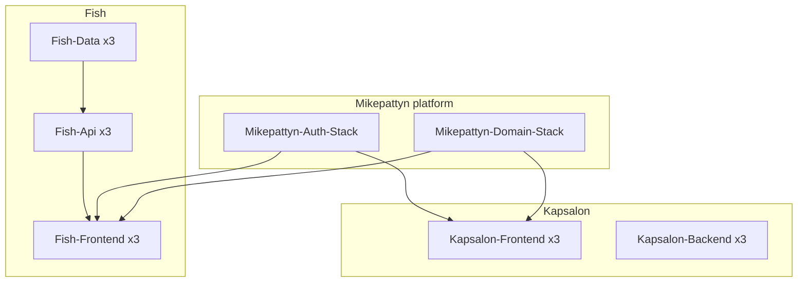

# Project Architecture Blueprint

Generated for the mikepattyn platform umbrella repository.

## Overview

Git-submodule umbrella with centralized AWS CDK (.NET 10) at `infra/cdk/`. Applications live under `apps/` as independent repos; platform owns DNS imports, OIDC, and per-app infrastructure stacks on `mikepattyn.nl`.

**Principles**

- Import-only domain/TLS (no CDK-created hosted zones or certs)
- One construct library, one deploy app
- Greenfield stacks on new hostnames; legacy kapsalon domain untouched
- Tests at construct/stack seams (hostname mapping, domain import, hosting, fish edge behaviors)

## Stack map

## Layer boundaries

| Layer | Location | Responsibility |
|-------|----------|----------------|
| Deploy app | `Mikepattyn.CDK` | `Program.cs` stack order, `app.Synth()` |
| Constructs | `Mikepattyn.CDK.Constructs` | Reusable AWS resources, app stacks |
| Kapsalon app | `apps/kapsalon` | Angular + Lambda APIs |
| Fish app | `apps/fishi-tracking-app` | Flutter + ASP.NET Core |

## Kapsalon architecture

- **Frontend**: S3 + CloudFront + Route53 CNAME per env
- **Backend**: DynamoDB single-table, 4 Lambdas, API Gateway REST + WAF, Authress secrets
- **Deploy**: `make lambda-build` → `infra/cdk/Mikepattyn.CDK/lambda/kapsalon.zip`

## Fish architecture

- **Data**: VPC, RDS PostgreSQL, S3 photos bucket
- **Api**: ECS Fargate + ALB (SignalR-ready stickiness)
- **Edge**: CloudFront path split — SPA on S3, `/api/*` and `/hubs/*` to ALB
- **Web**: `make fish-web-build` → sync to S3 bucket from SSM

## Cross-cutting

- **OIDC**: GitHub `mikepattyn/mikepattyn` → `/github-actions/mikepattyn/`
- **SSM**: `/{AppName}/{Environment}/{Layer}/{Parameter}`
- **Config**: `Constants.Deployment.cs` (gitignored; copy from `.example`)

## Adding a new application

1. Add submodule under `apps/{name}`
2. Add `AppSlug` + stacks in `Mikepattyn.CDK.Constructs/Stacks/{App}/`
3. Register stacks in `Program.cs`
4. Extend `AuthStack` S3/CloudFront/SSM ARNs
5. Add ADR + CONTEXT entries

## Common pitfalls

- Do not use nested DNS labels without cert SANs/wildcards
- Do not duplicate CDK in app submodules
- Fish SignalR requires ALB stickiness and disabled CloudFront caching on `/hubs/*`

*Last updated: implementation of platform CDK migration.*
