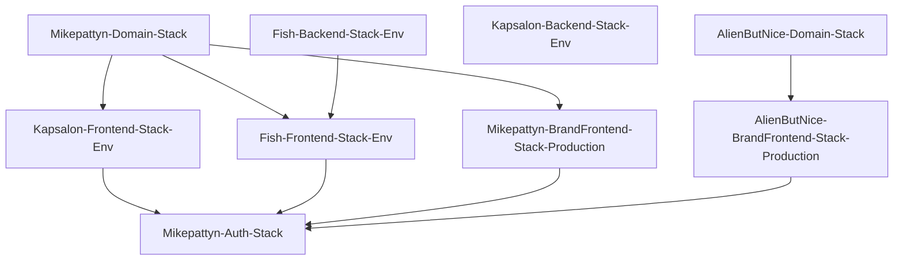

# Individual app deploy from the monorepo

Research summary for deploying kapsalon, fish, mikepattyn portfolio, and alienbutnice from this repository without deploying the full platform.

Sources: [`infra/cdk/Mikepattyn.CDK/StackComposition.cs`](../../infra/cdk/Mikepattyn.CDK/StackComposition.cs), [`Makefile`](../../Makefile), [`Constants.cs`](../../infra/cdk/Mikepattyn.CDK.Constructs/Constants.cs), kapsalon submodule deploy workflows.

## Deployable units

| App | Path | CDK stacks (per env unless noted) | Prerequisite stacks |
|-----|------|-----------------------------------|---------------------|
| Kapsalon | `apps/kapsalon` | `Kapsalon-Backend-Stack-{Env}`, `Kapsalon-Frontend-Stack-{Env}` | `Mikepattyn-Domain-Stack`; frontend stack needs backend API hostname |
| Fish | `apps/fishi-tracking-app` | `Fish-Backend-Stack-{Env}`, `Fish-Frontend-Stack-{Env}` | `Mikepattyn-Domain-Stack`; edge stack needs backend API hostname |
| Mikepattyn portfolio | `apps/mikepattyn` | `Mikepattyn-BrandFrontend-Stack-Production` | `Mikepattyn-Domain-Stack` |
| AlienButNice | `apps/alienbutnice` | `AlienButNice-BrandFrontend-Stack-Production` | `AlienButNice-Domain-Stack` |
| Shared | — | `Mikepattyn-Auth-Stack` | OIDC for GitHub Actions; not required for runtime |

Environments (`Development`, `Staging`, `Production`) map to hostnames via [`AppHostnames`](../../infra/cdk/Mikepattyn.CDK.Constructs/AppHostnames.cs). Brand frontends are Production-only.

Current **AppHostname** labels (see [CONTEXT.md](../../CONTEXT.md)):

| App | Development | Staging | Production |
|-----|-------------|---------|------------|
| Kapsalon | barbershop-dev.mikepattyn.nl | barbershop-acc.mikepattyn.nl | barbershop.mikepattyn.nl |
| Fish | gofish-dev.mikepattyn.nl | gofish-acc.mikepattyn.nl | gofish.mikepattyn.nl |

## AppHostname cutover (manual, after CDK slug change merges)

Redeploy frontend/edge stacks to publish new Route53 CNAMEs and CloudFront aliases (hard cut — old `fish*` / `kapsalon*` names stop resolving):

```bash
cdk deploy Kapsalon-Frontend-Stack-Development
cdk deploy Kapsalon-Frontend-Stack-Staging
cdk deploy Kapsalon-Frontend-Stack-Production
cdk deploy Fish-Frontend-Stack-Development
cdk deploy Fish-Frontend-Stack-Staging
cdk deploy Fish-Frontend-Stack-Production
```

Or via Make: `make cdk-deploy-kapsalon-dev` (etc.) for each environment.

Post-deploy checklist:

1. **Authress console:** allow new origins/redirects for `https://barbershop*.mikepattyn.nl` and `https://gofish*.mikepattyn.nl` (login URLs stay in app config, not CDK).
2. **Smoke:** HTTPS on new hostnames; same-origin `/api` responds; confirm old hostnames no longer resolve.

## SSM parameters for content deploy

CDK publishes deployment targets to SSM. Content sync scripts read these, then `aws s3 sync` and CloudFront invalidation.

| App | Bucket parameter | Distribution parameter |
|-----|------------------|------------------------|
| Kapsalon | `/Kapsalon/{Env}/Frontend/BucketName` | `/Kapsalon/{Env}/Frontend/DistributionId` |
| Fish edge | `/Fish/{Env}/Frontend/WebBucket` | `/Fish/{Env}/Frontend/DistributionId` |
| Mikepattyn brand | `/Mikepattyn/Production/Frontend/BucketName` | `/Mikepattyn/Production/Frontend/DistributionId` |
| AlienButNice brand | `/AlienButNice/Production/Frontend/BucketName` | `/AlienButNice/Production/Frontend/DistributionId` |

Kapsalon SPA uses relative `apiBaseUrl: '/api'` on the app hostname. SSM `/Kapsalon/{Env}/Backend/ApiUrl` is ops-only (execute-api base including `/api`).

## Lambda function naming

From [`BaseConstruct.GetUniqueApiName`](../../infra/cdk/Mikepattyn.CDK.Constructs/BaseConstruct.cs):

- Kapsalon: `Kapsalon-{Authorizer|Scheduling-Api|Identity-Api|Tenant-Api}-{Env}`
- Fish: `Fish-{Authorizer|Spots-Api|Catches-Api|Profile-Api|Community-Api}-{Env}`

## Make entrypoints

| Intent | Target pattern |
|--------|----------------|
| Infra only | `cdk-deploy-*` |
| Content only | `sync-*` |
| Full local ship | `deploy-*` (= infra + content) |

Examples:

```bash
make cdk-deploy-kapsalon-dev          # CDK frontend + backend stacks
make sync-kapsalon-frontend-dev       # Angular build → S3
make deploy-mikepattyn                # brand stack + Vite build → S3
```

## CI (root `.github/workflows`)

- **Content:** path-filtered workflows on `main`; kapsalon/fish default to Development; brands to Production.
- **Infra:** `deploy-cdk.yml` is `workflow_dispatch` only — no auto CDK on merge.
- **Source of truth:** root workflows call Make/scripts. Workflows under `apps/kapsalon/.github` are legacy (they do not run from this monorepo).

## Stack dependency graph



## Gaps addressed in this work

1. Fish Makefile targets renamed from obsolete `Fish-Data` / `Fish-Api` to `Fish-Backend` / `Fish-Frontend`.
2. `AlienButNice-Domain-Stack` included in shared domain deploy targets.
3. Brand sites split into individual `cdk-deploy-mikepattyn` / `cdk-deploy-alienbutnice`.
4. SSM-based content sync scripts and `sync-*` / `deploy-*` Make targets for all four apps.
5. Root GitHub Actions for content deploy and manual CDK dispatch.
